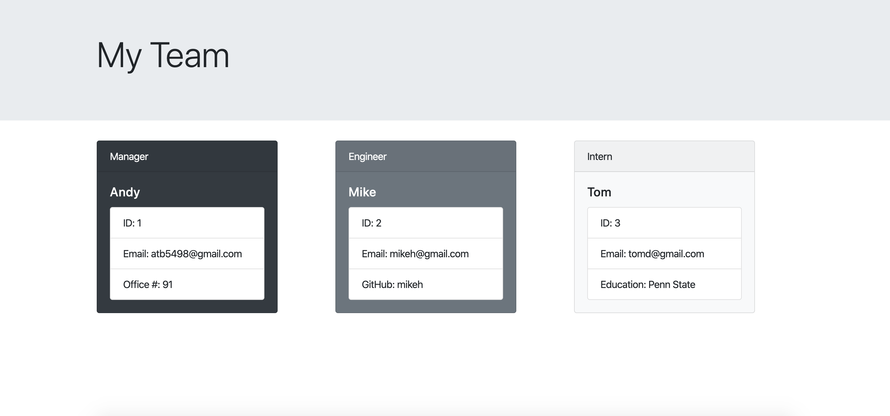

# DeveloperProfileGenerator
This application is intended to allow users to generate an html file that displays a team of engineers and interns, along with their basic information. 

# User story
AS A manager

I WANT to generate a webpage that displays my team's basic info

SO THAT I have quick access to their information

# Getting Started
1. Type node app.js in the command line
2. Answer the following prompts to provide information about yourself, engineers, and interns
3. An html file is generated and written to index.html to be viewed in the browser

# Link
https://github.com/atb5498/TeamGenerator

# Built With
Bootstrap: https://getbootstrap.com/

npm: https://www.npmjs.com/

Inquirer.js: https://www.npmjs.com/package/inquirer
